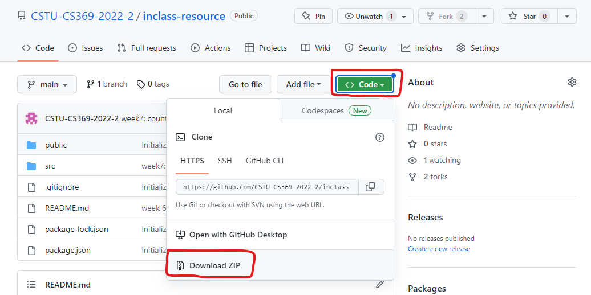

## How to run this project

```
git clone https://github.com/CSTU-CS369-2022-2/inclass-resource.git
cd inclass-resource
cd client
npm install
npm start
```

```
cd inclass-resource
cd server
npm install
npm start
```

## How to keep update this project
```
cd inclass-resource
git fetch --all
git pull origin main
```

# How to download repository without using Git



## How to test with Jest and React Testing Framework

1. 
	```
	npm install -D jest jest-dom
	```
1. สร้างโฟลเดอร์ `__tests__` ใน hierarchy เดียวกับไฟล์ที่เราต้องการจะ test
1. สร้างไฟล์ใหม่ในโฟลเดอร์ `__tests__` ที่มีชื่อเดียวกับไฟล์ที่เราต้องการจะ test 
   - เช่น หากจะ test ไฟล์ `AppCounter.js` ก็สร้างไฟล์ชื่อ `AppCounter.js` เหมือนกัน
2. เขียน test case
   - ดูตัวอย่างได้ที่ branch `testing-example`
3. รันคำสั่ง test ด้วย `npm test`

> การสร้างไฟล์ test สามารถสร้างได้หลายวิธีแล้วแต่ convention ของแต่ละทีม และแต่ละ testing framework โดยถ้าหากใช้ jest จะสามารถได้ 2 วิธีเบื้องต้นคือ
>
> 1.  สร้างโฟลเดอร์ `__tests__` และสร้างไฟล์ .js ในโฟลเดอร์นั้น
> 
> หรือ
> 
> 2. สร้างไฟล์ชื่อ `[ชื่อไฟล์].test.js` หรือ `[ชื่อไฟล์test].spec.js`
> 
> อ้างอิง https://jestjs.io/docs/configuration#testregex-string--arraystring
